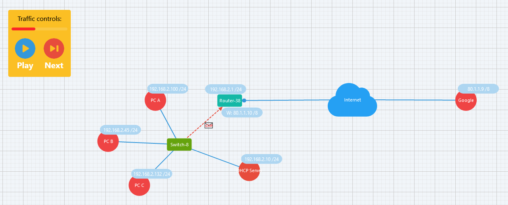

#   network-sim 

network-sim is educational network simulation tool. 

## Motivation 🤗

This tool should help students to understand networking principles. It does not implement all protocols correctly. 

You can try it [here](https://jomaway.github.io/network-sim/).

## Warning ⚠️

This project ist only a first prototype. 
There a still many bugs and features missing.

Ideas and help are always welcome. 

